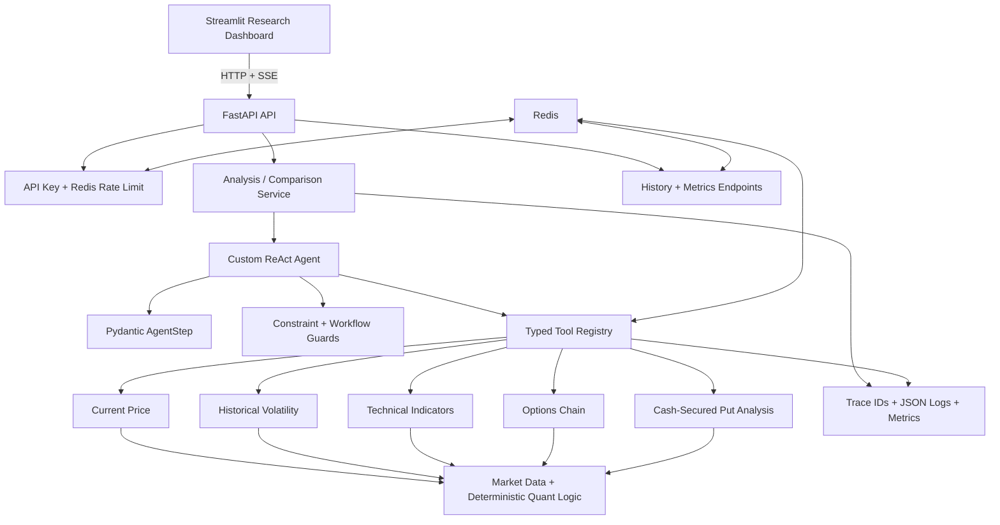

# AI Investment Copilot

AI Investment Copilot is an end-to-end agentic investment research platform. A custom ReAct agent selects structured financial tools, grounds its conclusions in market-data observations, and streams its reasoning workflow through FastAPI to an interactive Streamlit dashboard.

The project is designed to demonstrate applied AI engineering across agent orchestration, typed tool use, quantitative finance, evaluation, backend reliability, observability, and product-facing data visualization.

> **Educational research project only. This is not financial advice.** Market data may be delayed, incomplete, or inaccurate. Verify all information independently before making financial decisions.

---

## Current Milestone

| Area | Latest verified result |
|---|---|
| Product | Interactive Streamlit research dashboard complete |
| Automated tests | **419 passing pytest tests** |
| Golden evaluation | **10/10 queries passed (100%)** |
| LLM-as-judge | **5.0/5.0 average** across grounding, reasoning, hallucination control, and overall quality |
| Judge failures | **0** |

The golden pass/fail result is determined by deterministic contracts. LLM-as-judge scoring is an additional diagnostic signal and does not override those checks. See the [latest golden-evaluation result](evals/results/latest_golden_eval.json).

---

## Product Experience

Ask questions such as:

```text
Is it a good time to write a cash-secured put on ORCL?
```

```text
Is it a good time to write a $170 cash-secured put on ORCL?
```

```text
Analyze AAPL using RSI 14 and a 50-day moving average.
```

```text
Compare ORCL and MSFT for writing cash-secured puts.
```

The copilot can:

- select and execute market-data, technical-analysis, volatility, options, and risk tools
- preserve explicit user constraints such as ticker, strike, and expiration window
- calculate cash-secured-put premium, collateral, break-even, returns, and downside buffers
- compare multiple tickers using the same research workflow
- handle unavailable tickers without inventing prices or option contracts
- stream thoughts, tool calls, observations, corrections, and the final answer over SSE
- expose the evidence and provenance behind every displayed financial value

### Streamlit Research Dashboard

The frontend is a thin client over the FastAPI streaming API. It contains:

- a polished research brief with preset and free-form queries
- live status, evidence-count, and tool-count metrics
- a real-time agent activity timeline and trace ID
- a grounded-evidence table built from successful tool observations
- an expiration payoff chart with strike, spot, break-even, maximum profit, and maximum loss
- an options-market-quality dashboard with bid/ask ranges, quote status, open interest, and volume by strike
- a technical-indicator dashboard covering price positioning, RSI (14), and MACD
- a developer trace for inspecting the complete agent workflow

The charts are generated from validated tool outputs—not values parsed from the model's prose.

---

## Architecture



### Request Lifecycle

```text
User query
  -> FastAPI authentication and rate limit
  -> ReAct thought
  -> validated tool call
  -> deterministic tool execution
  -> structured observation
  -> grounded final-answer synthesis
  -> streamed research brief and visual evidence
```

---

## Engineering Highlights

### Custom ReAct Agent

The agent follows a structured loop:

```text
Thought -> Tool Call -> Observation -> Thought -> ... -> Final Answer
```

Every model response is validated as an `AgentStep`. A step must select exactly one action: a typed tool call or a non-empty final answer.

The loop includes:

- maximum-step and total-runtime guardrails
- model-request timeouts with one bounded retry for transient HTTP timeouts
- one bounded retry for invalid structured model output
- safe tool-error observations instead of process crashes
- workflow-correction events when a CSP answer is attempted before analysis
- complete trace capture for debugging and UI streaming

### Typed Tool Registry

Each registered tool defines:

- a unique name and model-facing description
- a Pydantic input model
- a Pydantic output model
- a deterministic Python function

The registry validates inputs and outputs, controls which tools the model can execute, records latency and success metrics, and caches eligible results.

| Tool | Purpose |
|---|---|
| `get_current_price` | Retrieve the latest available daily closing price and effective date |
| `get_historical_volatility` | Calculate annualized realized volatility over a validated lookback window |
| `analyze_technical_indicators` | Compute SMA, EMA, RSI, MACD, and Bollinger Bands |
| `get_options_chain` | Select and return a validated sample of put or call contracts |
| `analyze_cash_secured_put` | Calculate payoff, collateral, return, break-even, and risk metrics |

### Deterministic CSP Safeguards

The model plans the workflow, but deterministic code protects important financial constraints:

- explicit strikes are extracted from the user query and enforced on chain retrieval and CSP analysis
- default option selection uses a defined expiration policy and reference-price filtering
- bid/ask data is classified as normal, wide, crossed, or unavailable
- premium selection records whether it came from user input, a bid/ask midpoint, or the last price
- the agent must attempt CSP analysis after selecting an options contract
- final CSP answers are instructed to report ticker, spot, strike, expiration, premium, break-even, and required cash
- comparisons report the required fields separately for each analyzed ticker

### Quantitative Outputs

The CSP analysis calculates:

- spot price and observation date
- strike and expiration
- premium and quote provenance
- break-even price
- cash collateral required
- maximum profit and maximum loss
- simple return on secured cash
- simple non-compounded annualized return
- distance to strike and break-even

Limitations such as fees, taxes, slippage, dividends, and early assignment are explicitly recorded by the tool.

---

## FastAPI Interface

| Method | Endpoint | Purpose |
|---|---|---|
| `GET` | `/` | Health-style service response |
| `POST` | `/analyze` | Run one analysis and return JSON |
| `POST` | `/analyze/stream` | Stream one analysis over SSE |
| `POST` | `/compare` | Compare 2–5 tickers and return JSON |
| `POST` | `/compare/stream` | Stream a comparison over SSE |
| `GET` | `/history/{session_id}` | Retrieve saved session analyses |
| `GET` | `/metrics` | Retrieve in-process request and tool metrics |

All analysis, comparison, history, and metrics endpoints require the `X-API-Key` header.

---

## Redis and Graceful Degradation

Redis supports:

- fixed-window API rate limiting
- five-minute caching for eligible tool responses
- 24-hour session-history storage

The core analysis path remains available during a Redis outage:

- rate limiting fails open and emits a structured event
- cache read/write failures are logged and the tool executes normally
- history-write failures are logged without replacing a successful analysis

History retrieval still requires Redis because Redis is the source of that data.

---

## Evaluation System

The evaluation stack separates deterministic correctness from probabilistic quality scoring.

### 1. Pytest Suite

The current suite contains **419 passing tests** covering:

- agent-step schemas, validation retries, timeout retries, and runtime guards
- deterministic strike preservation and CSP workflow correction
- risk metrics, payoff curves, and technical indicators
- market-data and options-tool wrappers with mocked providers
- tool registry validation, caching, and observability
- Redis failure behavior, rate limiting, history, and API services
- SSE parsing and protocol validation
- Streamlit evidence builders and Plotly chart models
- golden-query schemas, matchers, persistence, and reports

Run it with:

```bash
python -m pytest
```

### 2. Golden Query Dataset

The 10-case JSONL benchmark covers:

- vague CSP selection
- explicit strike preservation
- explicit 30–60 DTE constraints
- technical analysis
- historical volatility
- multi-ticker CSP comparison
- invalid ticker handling
- company-name-to-ticker resolution

### 3. Deterministic Release Checks

Each golden case evaluates four contracts:

- agent status is successful
- required tool calls match expected names, arguments, outcomes, and call counts
- required answer literals or accepted literal alternatives are preserved
- required financial concepts appear using registered language patterns

Failures identify unsatisfied tool calls, missing literals, unsatisfied alternative groups, missing concepts, and agent errors.

### 4. LLM-as-Judge

An optional Gemini judge scores each answer against only the query, tool trace, and final response:

- factual grounding
- reasoning quality
- hallucination control
- overall answer quality

Judge failures are isolated from deterministic evaluation. Judge scores are saved for analysis but do not change the golden pass/fail result.

### 5. Persistence and Reporting

Evaluation runs can be stored in SQLite and converted into Markdown reports. The runner waits between cases by default to reduce provider rate-limit pressure.

Run all golden cases with judge scoring and persistence:

```bash
python -m evals.run_golden_eval \
  --limit 10 \
  --judge \
  --save-db
```

List persisted runs:

```bash
python -m evals.list_runs
```

Generate a report from the latest persisted run:

```bash
python -m evals.generate_report
```

---

## Observability

Every request receives a `trace_id` that is propagated through:

- JSON responses and SSE events
- ReAct thought and correction events
- tool calls and observations
- session-history records
- structured JSON logs

Tool logs include:

- tool name and trace ID
- success and cache-hit state
- latency in milliseconds
- summarized inputs and outputs
- error type and message on failure

The protected `/metrics` endpoint reports in-process request and tool statistics, including latency percentiles, failure rate, and cache-hit rate. Metrics reset when the API process restarts.

---

## Tech Stack

| Layer | Technology |
|---|---|
| Language | Python 3.12 |
| LLM | Gemini API |
| Agent | Custom ReAct loop with structured outputs |
| API | FastAPI, Server-Sent Events, Uvicorn |
| Validation | Pydantic |
| Frontend | Streamlit, Plotly |
| Market Data | yfinance, pandas, NumPy |
| Quant Logic | Deterministic Python analytics |
| Cache / Rate Limit / History | Redis |
| Eval Persistence | SQLite |
| Testing | pytest, pytest-mock |
| Packaging | Docker, Docker Compose |
| CI | GitHub Actions |
| Observability | Trace IDs, structured JSON logs, in-process metrics |

---

## Project Structure

```text
.
├── agents/
│   ├── query_constraints.py     # Deterministic user-constraint guards
│   ├── react_agent.py           # ReAct loop, retries, streaming events
│   └── schemas.py               # Structured agent-step contracts
├── analysis/
│   ├── risk_metrics.py          # CSP payoff and return calculations
│   └── stock_analysis.py        # Technical-indicator calculations
├── api/
│   ├── app.py                   # FastAPI routes
│   ├── auth.py                  # API-key authentication
│   ├── history.py               # Redis session history
│   ├── rate_limit.py            # Redis-backed rate limiting
│   ├── redis_client.py
│   ├── schemas.py
│   └── service.py               # Async service and SSE orchestration
├── apps/
│   ├── assets/styles.css        # Dashboard visual system
│   ├── activity_timeline.py
│   ├── charts.py                # CSP and technical Plotly figures
│   ├── csp_payoff.py
│   ├── grounded_evidence.py
│   ├── options_charts.py
│   ├── options_liquidity.py
│   ├── sse_client.py
│   ├── streamlit_app.py
│   └── technical_snapshot.py
├── evals/
│   ├── concept_patterns.py      # Registered semantic answer patterns
│   ├── generate_report.py
│   ├── golden_queries.jsonl
│   ├── judge.py
│   ├── load_golden.py
│   ├── run_golden_eval.py
│   ├── schemas.py
│   └── store_results.py
├── observability/
│   ├── logging.py
│   └── metrics.py
├── tools/
│   ├── basic_market_tools.py
│   ├── cache.py
│   ├── market_data.py
│   ├── options_tools.py
│   ├── registry.py
│   ├── setup_registry.py
│   └── technical_analysis_tools.py
├── tests/
├── .github/workflows/
│   ├── ci.yml
│   └── eval.yml
├── Dockerfile
├── docker-compose.yml
└── requirements.txt
```

---

## Local Setup

### Prerequisites

- Python 3.12
- a Gemini API key
- Redis for rate limiting, caching, and session history

### 1. Create and Activate a Virtual Environment

```bash
python -m venv .venv
source .venv/bin/activate
```

On Windows PowerShell:

```powershell
.venv\Scripts\Activate.ps1
```

### 2. Install Dependencies

```bash
python -m pip install --upgrade pip
python -m pip install -r requirements.txt
```

### 3. Configure Environment Variables

Create a `.env` file in the project root:

```env
GEMINI_API_KEY=your-gemini-api-key
COPILOT_API_KEY=dev-secret-key
REDIS_URL=redis://localhost:6379/0
API_BASE_URL=http://127.0.0.1:8000
```

Do not commit `.env` or real credentials.

### 4. Start Redis

With a local Redis installation:

```bash
redis-server
```

Or start only the Compose Redis service:

```bash
docker compose up redis
```

### 5. Start FastAPI

```bash
python -m uvicorn api.app:app --reload
```

The API will be available at `http://127.0.0.1:8000`.

### 6. Start Streamlit

In a second terminal with the same environment configured:

```bash
python -m streamlit run apps/streamlit_app.py
```

Streamlit will print the local dashboard URL, normally `http://localhost:8501`.

---

## Docker

Build the backend image:

```bash
docker build -t ai-investment-copilot-api .
```

Run the backend with a local environment file:

```bash
docker run --rm \
  --env-file .env \
  -p 8000:8000 \
  ai-investment-copilot-api
```

Run the FastAPI backend and Redis together:

```bash
docker compose up --build
```

The current Docker image packages the backend. Run Streamlit separately using the local command above.

---

## API Examples

### Analyze

```bash
curl -X POST "http://127.0.0.1:8000/analyze" \
  -H "Content-Type: application/json" \
  -H "X-API-Key: dev-secret-key" \
  -d '{"session_id":"demo-session","query":"What is ORCL recent historical volatility?"}'
```

### Stream an Analysis

```bash
curl -N -X POST "http://127.0.0.1:8000/analyze/stream" \
  -H "Content-Type: application/json" \
  -H "X-API-Key: dev-secret-key" \
  -d '{"session_id":"demo-session","query":"Is it a good time to write a cash-secured put on ORCL?"}'
```

### Compare Tickers

```bash
curl -X POST "http://127.0.0.1:8000/compare" \
  -H "Content-Type: application/json" \
  -H "X-API-Key: dev-secret-key" \
  -d '{"tickers":["ORCL","MSFT"],"question":"Which looks better for writing cash-secured puts?","session_id":"demo-session"}'
```

### Retrieve History

```bash
curl -X GET "http://127.0.0.1:8000/history/demo-session" \
  -H "X-API-Key: dev-secret-key"
```

### Inspect Metrics

```bash
curl -X GET "http://127.0.0.1:8000/metrics" \
  -H "X-API-Key: dev-secret-key"
```

---

## Continuous Integration

The main GitHub Actions workflow runs on pushes to `main` and includes:

1. dependency installation on Python 3.12
2. the complete pytest suite with a Redis service container
3. a Docker image build after tests succeed

A separate manual workflow runs golden evaluations with an optional judge, persists the run to SQLite, generates a Markdown report, and uploads the JSON, database, and report as workflow artifacts. Live evals remain manual because they call an external model API and may consume quota.

---

## Current Scope and Limitations

- The project is a research and engineering demonstration, not a brokerage or trade-execution system.
- It does not provide personalized financial advice or guarantee investment outcomes.
- Market and options data come from yfinance and may be delayed or incomplete.
- Options analysis uses sampled contracts and simplified return assumptions.
- Annualized CSP return is simple and non-compounded.
- Fees, taxes, execution slippage, dividends, and early assignment are not fully modeled.
- In-process metrics reset when the API restarts.
- LLM output remains probabilistic even with structured tools, safeguards, and evals.

---

## Roadmap

### Completed

- custom ReAct agent and Pydantic tool registry
- price, volatility, technical-analysis, options-chain, and CSP tools
- FastAPI JSON and SSE interfaces
- Redis-backed rate limiting, caching, and session history
- structured logging, trace propagation, and metrics
- Docker backend, Docker Compose, and GitHub Actions CI
- interactive Streamlit dashboard with technical, options, and payoff visualizations
- 419-test automated suite and 10-query golden benchmark
- optional LLM-as-judge, SQLite persistence, and Markdown reporting

### Next

- public deployment and recorded product demo
- README screenshots and a concise engineering case study
- broader multi-turn and adversarial evaluation coverage
- deeper production hardening only where it materially improves the public demo

---

## Design Principles

- **LLM plans; tools compute.** Financial values come from typed tools and deterministic calculations.
- **Evidence before prose.** The UI renders provenance and charts from tool observations rather than trusting generated text.
- **Constraints are executable.** Explicit strikes and required CSP workflow steps are enforced in code.
- **Deterministic evals gate quality.** LLM-as-judge adds context but does not control pass/fail.
- **Failures should degrade safely.** Retries are bounded, tool failures become observations, and Redis is not a single point of failure for analysis.
- **Demo value before infrastructure theater.** The roadmap prioritizes a finished, inspectable AI product over premature cloud complexity.

---

## Author

Andrew Chen  
Statistics and Economics, UC Davis  
[LinkedIn](https://www.linkedin.com/in/andrew-yihanchen) | [GitHub](https://github.com/Andrewchenyh)
