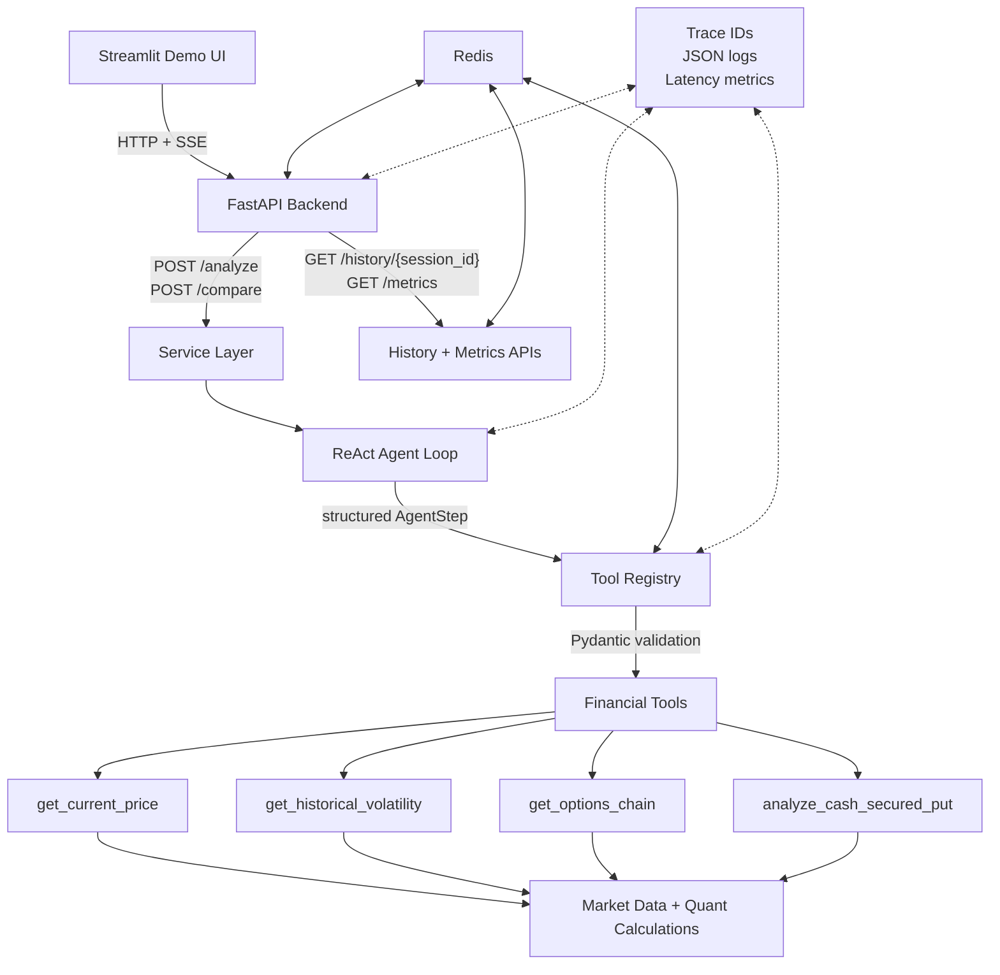

# AI Investment Copilot

AI Investment Copilot is an agentic investment research assistant built around a ReAct loop, structured financial tools, streaming FastAPI endpoints, evaluation, and observability.

The project is designed to demonstrate applied AI engineering skills: tool use, structured outputs, backend service design, evals, caching, tracing, and a transparent demo UI.

> Educational research project only. This is not financial advice.

---

## What It Does

Ask a question like:

```text
Is it a good time to write a cash-secured put on ORCL?
```

The system can:

- reason about which information it needs
- call financial tools for current price, historical volatility, options chains, and cash-secured-put metrics
- stream thoughts and tool calls to the UI in real time
- produce a final answer grounded in tool observations
- expose trace IDs, JSON logs, and metrics for debugging
- evaluate agent behavior against a golden benchmark set

---

## Architecture



The Streamlit frontend is a thin client. It does not run agent logic directly; it calls the FastAPI backend over HTTP and Server-Sent Events.

---

## Key Features

### ReAct Agent Loop

The agent follows a structured loop:

```text
reason -> choose tool -> execute tool -> observe result -> continue or answer
```

The loop includes max-step guardrails, structured model outputs, allowed-tool dispatch through a registry, tool error handling, and trace capture.

### Strict Tool Contracts

Tools are registered with:

- name
- description
- Pydantic input schema
- Pydantic output schema
- deterministic Python function

This keeps the LLM from passing arbitrary arguments into finance code and makes tool behavior easier to test.

### Options and Risk Tools

The current options workflow supports:

- current price lookup
- realized historical volatility
- options chain retrieval
- target-strike and reference-price chain filtering
- smarter default expiration selection
- cash-secured-put payoff metrics

The `analyze_cash_secured_put` tool computes:

- spot price
- strike
- premium
- break-even
- max profit
- cash required
- simple return
- annualized return
- downside buffer to strike and break-even

### FastAPI Backend

Implemented endpoints:

```text
GET  /
POST /analyze
POST /analyze/stream
POST /compare
POST /compare/stream
GET  /history/{session_id}
GET  /metrics
```

The streaming endpoints use Server-Sent Events so clients can display live thoughts, tool calls, tool results, and final answers.

### Redis Caching, Rate Limiting, and History

Redis is used for:

- API rate limiting by API key
- caching repeated tool responses
- storing session history

This reduces duplicate market-data calls and adds basic backend production hygiene.

### Streamlit Demo UI

The Streamlit UI includes:

- preset demo queries
- live streamed final answer
- trace ID display
- live thoughts
- tool call/result panel
- grounded numbers table extracted from tool observations
- raw trace inspection

---

## Evaluation

AI Investment Copilot includes a layered evaluation system for both deterministic finance logic and LLM behavior.

### Evaluation Layers

**1. Deterministic Unit Tests**

The financial calculation layer is tested with `pytest`, including:

- cash-secured-put payoff metrics
- annualized return calculations
- technical indicators such as SMA, EMA, MACD, Bollinger Bands, and RSI
- mocked market-data and options-tool wrappers
- metrics/report/storage utilities

**2. Golden Dataset**

The project includes a JSONL benchmark set covering:

- cash-secured put analysis
- explicit strike preservation
- explicit days-to-expiration window preservation
- technical-indicator analysis
- volatility questions
- ticker comparison
- invalid ticker handling
- ambiguous company-name queries

**3. Deterministic Agent Checks**

The eval runner executes golden queries and checks:

- successful agent completion
- required tool calls, arguments, outcomes, and call counts
- exact user-supplied answer literals
- required answer concepts with accepted alternative phrasings

Failed cases report unsatisfied tool contracts, missing answer literals,
missing answer concepts, and agent or judge errors. LLM-as-judge scores are
reported separately and do not change the deterministic pass/fail result.

**4. LLM-as-Judge**

A judge model scores final answers against the tool trace on:

- factual grounding
- reasoning quality
- hallucination control
- overall quality

The judge is instructed to use only the provided query, trace, and final answer rather than external market knowledge.

**5. Persistence and Reports**

Eval runs can be saved to a local SQLite database and converted into Markdown reports.

### Running Evaluations


Run deterministic tests:

```bash
python -m pytest
```

Run golden evals with judge scoring and persistence:

```bash
python -m evals.run_golden_eval --limit 10 --judge --save-db
```

List saved eval runs:

```bash
python -m evals.list_runs
```

Generate a Markdown report:

```bash
python -m evals.generate_report
```

---

## Observability

The backend includes trace IDs, structured logs, and lightweight metrics.

### Trace IDs

Every request receives a `trace_id`, which is propagated through:

- API responses
- streaming SSE events
- ReAct trace entries
- tool observations
- saved session history
- JSON logs

Example response:

```json
{
  "status": "success",
  "trace_id": "acde7819-9c63-4c06-bd5d-73d9a0eb53c4",
  "answer": "...",
  "trace": []
}
```

### Structured Logs

Tool execution logs include:

- `trace_id`
- `tool_name`
- `latency_ms`
- `success`
- `cache_hit`
- input summary
- output summary or error

### Metrics

The protected `/metrics` endpoint returns request and tool metrics:

```bash
curl -X GET "http://127.0.0.1:8000/metrics" \
  -H "X-API-Key: dev-secret-key"
```

Example:

```json
{
  "requests": {
    "count": 2,
    "p50_latency_ms": 1735.11,
    "p95_latency_ms": 2567.42
  },
  "tools": {
    "count": 2,
    "failure_rate": 0.0,
    "cache_hit_rate": 0.5,
    "success_count": 2,
    "failure_count": 0,
    "cache_hit_count": 1,
    "cache_miss_count": 1
  }
}
```

Current metrics are in-process and reset when the server restarts. They are designed to be exportable to a production metrics system later.

---

## Tech Stack

| Layer | Technology |
|---|---|
| LLM | Gemini API |
| Agent | Custom ReAct loop |
| API | FastAPI, Server-Sent Events |
| Schemas | Pydantic |
| Frontend | Streamlit |
| Data | yfinance |
| Cache / Rate Limit / History | Redis |
| Eval Persistence | SQLite |
| Testing | pytest, pytest-mock |
| Packaging | Docker, Docker Compose |
| CI | GitHub Actions |
| Observability | trace IDs, JSON logs, in-process metrics |

---

## Project Structure

```text
.
├── agents/
│   ├── react_agent.py
│   └── schemas.py
├── analysis/
│   ├── risk_metrics.py
│   └── stock_analysis.py
├── api/
│   ├── app.py
│   ├── auth.py
│   ├── history.py
│   ├── rate_limit.py
│   ├── redis_client.py
│   ├── schemas.py
│   └── service.py
├── apps/
│   └── streamlit_app.py
├── evals/
│   ├── generate_report.py
│   ├── golden_queries.jsonl
│   ├── judge.py
│   ├── load_golden.py
│   ├── run_golden_eval.py
│   └── store_results.py
├── observability/
│   ├── logging.py
│   └── metrics.py
├── tools/
│   ├── basic_market_tools.py
│   ├── cache.py
│   ├── market_data.py
│   ├── options_tools.py
│   ├── registry.py
│   └── setup_registry.py
├── tests/
├── Dockerfile
├── docker-compose.yml
└── requirements.txt
```

---

## Local Setup

### 1. Install Dependencies

```bash
pip install -r requirements.txt
```

### 2. Configure Environment

Create a `.env` file:

```env
GEMINI_API_KEY=your_gemini_key
COPILOT_API_KEY=dev-secret-key
REDIS_URL=redis://localhost:6379/0
API_BASE_URL=http://127.0.0.1:8000
```

### 3. Run Redis

If running Redis locally:

```bash
redis-server
```

Or use Docker Compose as shown below.

### 4. Run FastAPI

```bash
uvicorn api.app:app --reload
```

### 5. Run Streamlit

```bash
streamlit run apps/streamlit_app.py
```

---

## Docker

Build the backend image:

```bash
docker build -t ai-investment-copilot-api .
```

Run with a local `.env` file:

```bash
docker run --rm \
  --env-file .env \
  -p 8000:8000 \
  ai-investment-copilot-api
```

Run FastAPI and Redis together:

```bash
docker compose up --build
```

---

## API Examples

### Analyze

```bash
curl -X POST "http://127.0.0.1:8000/analyze" \
  -H "Content-Type: application/json" \
  -H "X-API-Key: dev-secret-key" \
  -d '{"session_id":"demo-session","query":"What is ORCL recent historical volatility?"}'
```

### Streaming Analyze

```bash
curl -N -X POST "http://127.0.0.1:8000/analyze/stream" \
  -H "Content-Type: application/json" \
  -H "X-API-Key: dev-secret-key" \
  -d '{"session_id":"demo-session","query":"Is it a good time to write a cash-secured put on ORCL?"}'
```

### Compare

```bash
curl -X POST "http://127.0.0.1:8000/compare" \
  -H "Content-Type: application/json" \
  -H "X-API-Key: dev-secret-key" \
  -d '{"tickers":["ORCL","MSFT"],"question":"Which one looks better for writing cash-secured puts?","session_id":"demo-session"}'
```

### History

```bash
curl -X GET "http://127.0.0.1:8000/history/demo-session" \
  -H "X-API-Key: dev-secret-key"
```

---

## CI

GitHub Actions is configured for:

- dependency installation
- `pytest`
- Docker image build
- manual golden eval workflow with uploaded artifacts

Live evals are kept as a manual workflow because they call external APIs and may incur model cost.

---

## Roadmap Status

| Phase | Goal | Status |
|---|---|---|
| 1 | ReAct agent loop, tool registry, Pydantic tool contracts, finance tools | Complete |
| 2 | FastAPI, SSE streaming, API keys, Redis rate limiting/cache/history | Complete |
| 3 | Tests, golden dataset, LLM judge, SQLite persistence, reports | Complete |
| 4 | Docker, Compose, CI, manual eval workflow | Core complete, full AWS/Terraform deferred |
| 5 | Trace IDs, structured logs, metrics | Complete |
| 6 | Streamlit polish, README/case study, diagrams/screenshots | In progress |

---

## Design Decisions

- **LLM plans, tools compute.** The model decides which tool to call, but deterministic Python functions compute financial metrics.
- **Trace-first debugging.** Every request has a `trace_id` so failures can be followed through API, agent, and tool layers.
- **Evaluation before scale.** The project includes eval infrastructure before expanding the benchmark set.
- **Cloud IaC deferred.** Heavy AWS/Terraform work is intentionally deferred to prioritize applied AI engineering, evals, observability, and demo quality.

---

## Author

Andrew Chen  
Statistics and Economics, UC Davis  
[LinkedIn](https://www.linkedin.com/in/andrew-yihanchen) | [GitHub](https://github.com/Andrewchenyh)
